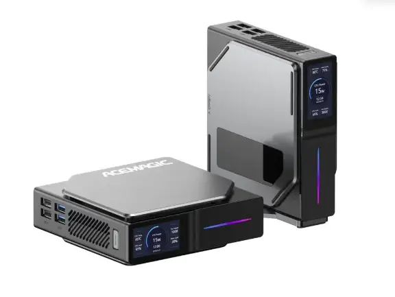
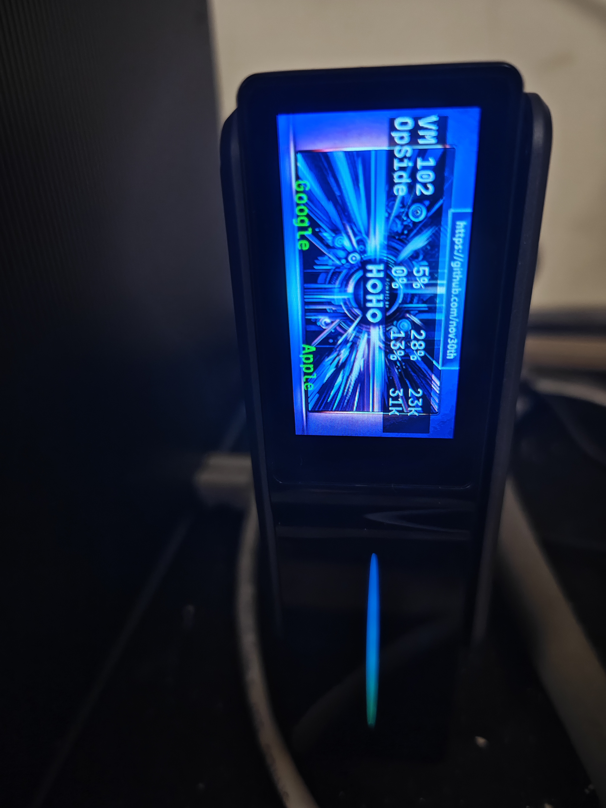

# Acemagic S1 Screen

这个项目的原因是看到这个mini电脑，适合做软路由及PVE运行虚拟机。同时用小屏幕显示状态。

但是期间碰到了不愉快的事情，在该产品店铺的JD客服，给出很多错误信息，甚至觉得高高在上，例如，“我们没有断电后开机功能”，“WOL唤醒功能不知道有没有，你需要自己看”等非常不负责任的态度，实际上是有断电开机功能即恢复供电S0状态。当然，问其是否有屏幕的协议以便我可以开源一个项目，免费给厂商，对方也高高挂起。所以该项目目前没有开源计划。

# Steps

1. Modify the config.json, change the PVE username and password
2. chmod +x core.bin
3. ./core.bin to start the program or put it into systemctl

