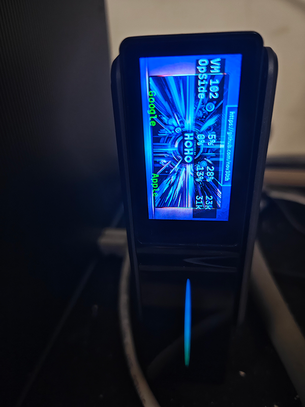
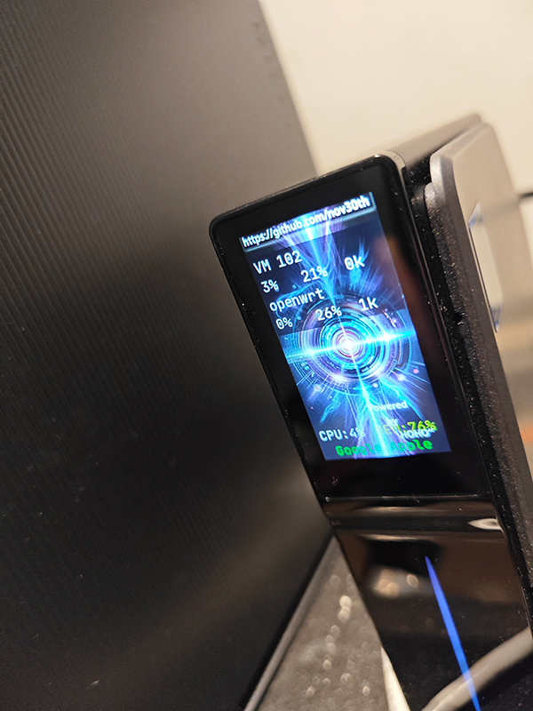

# Acemagic S1 Screen

Once this project receives over 100 stars, I will open-source it. It's just a Python file, so you can modify anything you want.

Currently, as I am busy with my work, I am archiving this release project, meaning there will be no updates. The latest PVE version, which I am using, is the same as the downloadable one and suits my daily needs.

I was planning to integrated my code with the [beatfuil screens](https://github.com/mathoudebine/turing-smart-screen-python/tree/main) but I just put the machine as PVE server and don't want to touch it. **The initial excitement when I first bought it has passed.**

If you don't use the PVE features or need open source ones, can have try with [this one from tjaworski](https://github.com/tjaworski/AceMagic-S1-LED-TFT-Linux/tree/main/s1panel) that he open source a program for screen, not the PVE version, written in npm language.

# Steps

1. Modify the config.json, change the PVE username and password
2. chmod +x core.bin
3. ./core.bin to start the program or put it into systemctl
# Config file

- "image_type" value could be "" (empty) or "shu". "shu" means vertical

# Versions

for PVE download the [PVE] version.

***for Linux/Windows/MacOS standalone download the [testing version 0.0.2](https://github.com/nov30th/s1-mini-computer-tft-screen-release/releases/tag/v0.0.2)***

Currently there is very very basic version in standalone version which is testing version, as I'm personal use my pve version and quite busy these days, the standalone updates may delay.

(if you need any features, just let me know I will put them into the program)

